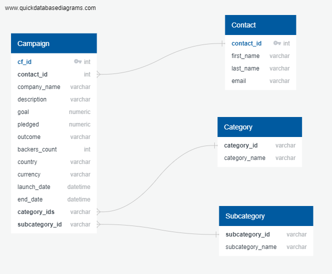

# Crowdfunding Project


**Answer:** When looking at the healthy loans, '0', the model shows precision as 1.00, recall as .99, and a f1-score as 1.00. The precision of 1.00 indicates that the model is correct 100% of the time and would have a signicantly low chance of producing a false positive. The recall of .99 indicates that the model correctly identifies all the healthy loans that are contained in this dataset with a 99% accuracy. The f1-score is  1.00 which suggests that there is a good balance between the precision and recall.

When looking at high-risk loans, '1', the model shows precision is .85, the recall is .99, and f1-score is .99. The precision at .86 indicates the model correctly predicts a high risk loan 86% of the time. The recall of .99 indicates that the model correctly identifies all the high risk loans 99% of the time. the f1-score of .88 indictaes a good balance between the precision and recall.

It is relatively good in predicting both high risk loans and healthy loans but is stronger in predicting healthy loans as was the model for the first question. Using the resampling led to the recall on high risk loans improving to 99% with precision decreasing to 85% and the f1-score increasing to 92%

# Description
This project aims to build an Extract, Transform, and Load (ETL) pipeline using Python, Pandas, and regular expressions. The main goal is to extract data from various sources, perform transformations on the data, and ultimately create four CSV files. These CSV files will serve as inputs for generating an Entity-Relationship Diagram (ERD) and a table schema. Finally, the transformed data will be loaded into a Postgres database.

# Project Structure
The project consists of the following components:

1. ETL_Mini_Project: The script responsible for extracting and transforming the data.

2. Resources Folder: Contains the necessary files for the ETL pipeline, including:
   
   •Four CSV files: These files store the transformed data after extraction and processing.
   
   •Two Excel files: The original data sources from which the data was imported.
   
4. Crowdfunding_db_schema: contains the table schema for the Postgres database
   
   

To use this project, follow the instructions below:

1. Clone the repository:

```git clone https://github.com/B-Aldridge/Crowdfunding_ETL.git```

2. Install the required dependencies if not already installed:

```pip install pandas```
```pip install numpy```

3. Navigate to the project directory:

```cd Crowdfunding_ETL```

4. Launch Jupyter Notebook from terminal:

```jupyter notebook```

5. Open the "ETL_Mini_Project.ipynb" notebook in Jupyter.

6. Run the cells in the notebook to execute the ETL pipeline. The notebook will extract data from the provided Excel files, perform necessary transformations using Pandas and regular expressions, and generate the CSV files.

7. Use the generated CSV files to create an Entity-Relationship Diagram (ERD) and a table schema for further analysis.

8. Load the transformed data from the CSV files into a Postgres database using your preferred method (e.g., psql command-line tool).

# Credits
Team responsible for the formation of this project:

Kiana Talavera: (https://github.com/talaverak)

Joey Sirko: (https://github.com/JoeySirko)

Joshua Aldridge: (https://github.com/B-Aldridge)


